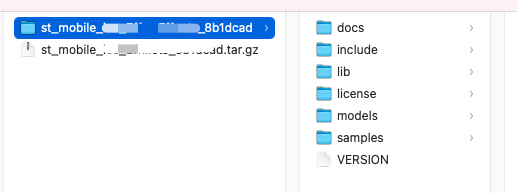

## iOS Sample 运行指南

## 目录
1. sample 运行
2. sample 主要文件结构


### 1. sample 运行
#### 1.1 解压压缩包 

如下图：



docs: 包含集成文档、常见问题、sample运行指南

include: SDK头文件

lib： SDK静态库文件

licnese：授权文件

models： 检测模型

samples： sample文件夹

VERSION: 版本信息


#### 1.2 运行项目 

用Xcode打开samples文件夹下的SenseMeEffects.xcodeproj

### 2. sample 主要文件结构
```
SenseMeEffectsCodes：
.
├── Audio：iOS音频处理类，负责播放贴纸的音效
│   ├── STAudioManager.h
│   ├── STAudioManager.m
│   ├── STEffectsAudioPlayer.h
│   ├── STEffectsAudioPlayer.m
│   ├── SoundInfomation.h
│   ├── SoundInfomation.m
│   ├── SystemSound.h
│   └── SystemSound.m
├── Camera：iOS相机(设置前后摄像头、设置分辨率、设置像素格式)
│   ├── STCamera.h
│   └── STCamera.m
├── ImageController：图片处理ViewController这个文件夹中有SDKAPI具体的使用方法
│   ├── PhotoProcessingVC.h
│   └── PhotoProcessingVC.m
├── LicenseUtil： License 管理类
│   ├── LicenseUtil.h
│   └── LicenseUtil.m
├── MainController ：预览处理ViewController
│   ├── PhotoSelectVC.h
│   ├── PhotoSelectVC.m
│   ├── PhotoSelectVC.xib
│   ├── STBaseViewController.h
│   ├── STBaseViewController.m
│   ├── ViewController.h
│   └── ViewController.m//这个文件夹中有SDKAPI具体的使用方法
├── Render ： 渲染处理
│   ├── STColorConversion.h //颜色空间转换
│   ├── STColorConversion.m
│   ├── STGLPreview2.h //预览view
│   ├── STGLPreview2.m
│   ├── STGLPreview3.h
│   ├── STGLPreview3.m
│   ├── STGLShader.h //OpenGL shader 创建、setAttribute、 setUniform
│   ├── STGLShader.m
│   ├── STVFShader.h
│   └── STVFShader.m
├── SampleDefaultSetting：数据源manager类
│   ├── DefaultBeautyParameters.h
│   ├── STDefaultSetting.h
│   ├── STDefaultSetting.m
│   └── datasources
├── UIElements： Demo中所用的UI
│   ├── EffectsCollectionView.h
│   ├── EffectsCollectionView.m
│   ├── EffectsCollectionViewCell.h
│   ├── EffectsCollectionViewCell.m
│   ├── EffectsCollectionViewCell.xib
│   ├── STBMPCollectionView.h
│   ├── STBMPCollectionView.m
│   ├── STBMPCollectionViewCell.h
│   ├── STBMPCollectionViewCell.m
│   ├── STBMPDetailColV.h
│   ├── STBMPDetailColV.m
│   ├── STBMPDetailColVCell.h
│   ├── STBMPDetailColVCell.m
│   ├── STBeautySlider.h
│   ├── STBeautySlider.m
│   ├── STBmpStrengthView.h
│   ├── STBmpStrengthView.m
│   ├── STButton.h
│   ├── STButton.m
│   ├── STCollectionView.h
│   ├── STCollectionView.m
│   ├── STCollectionViewCell.h
│   ├── STCollectionViewCell.m
│   ├── STCommonObjectContainerView.h
│   ├── STCommonObjectContainerView.m
│   ├── STCommonObjectView.h
│   ├── STCommonObjectView.m
│   ├── STCustomCollectionView.h
│   ├── STCustomCollectionView.m
│   ├── STCustomMemoryCache.h
│   ├── STCustomMemoryCache.m
│   ├── STFilterView.h
│   ├── STFilterView.m
│   ├── STMakeupDataModel.h
│   ├── STMakeupDataModel.m
│   ├── STParamUtil.h
│   ├── STParamUtil.m
│   ├── STPlayerControlBar.h
│   ├── STPlayerControlBar.m
│   ├── STScrollTitleView.h
│   ├── STScrollTitleView.m
│   ├── STSlideView.h
│   ├── STSlideView.m
│   ├── STSlideView.xib
│   ├── STTitleViewItem.h
│   ├── STTitleViewItem.m
│   ├── STTriggerView.h
│   ├── STTriggerView.m
│   ├── STViewButton.h
│   ├── STViewButton.m
│   ├── STViewButton.xib
│   ├── UIView+Toast.h
│   └── UIView+Toast.m
├── Util：小工具类
│   ├── NSBundle+language.h
│   ├── NSBundle+language.m
│   ├── STConvert.h
│   ├── STConvert.m
│   ├── STEffectsTimer.h
│   ├── STEffectsTimer.m
│   ├── STLock.h
│   ├── STLock.m
│   └── STMobileLog.h
├── VideoController： 视频处理ViewController这个文件夹中有SDKAPI具体的使用方法
│   ├── VideoProcessingViewController.h
│   └── VideoProcessingViewController.m
├── VideoRecord： 视频录制类
│   ├── STMovieRecorder.h
│   └── STMovieRecorder.m
├── architecture
│   └── manager
└── resources： 各种资源文件(默认滤镜、美妆、贴纸)
    ├── Color
    ├── Filters
    ├── Makeup
    ├── StickerZipAndIcons
    ├── docs
    ├── license
    └── models
```